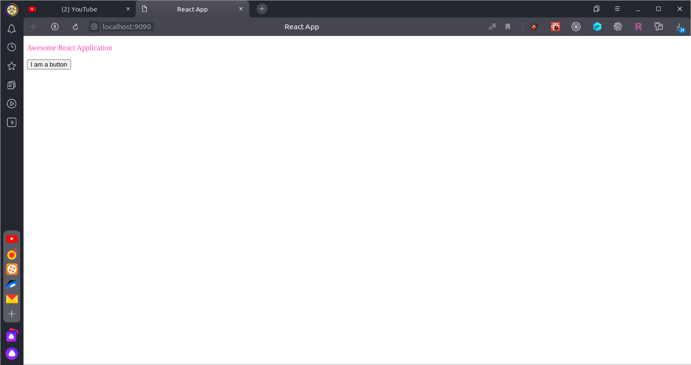

## Intro

В большинстве случаев при создании React-проекта разработчики пользуются утилитами типа `create-react-app`. 

И это вполне оправдано, ибо позволяет сэкономить немного времени на куче типовых действий. Однако многим разработчикам, которые таки или иначе сталкиваются с этим стеком технологий, порой хочется увидеть процесс настройки проекта изнутри - это позволяет лучше понимать возможности настройки окружения, а иногда - еще и быстрее решать возникающие в окружении проблемы. 

В этой статье мы step-by-step настроим полностью рабочий проект с **React** на борту, собираемый связкой **Webpack 5** + **Babel 7**, настроенный на **SCSS**-стили и содержащий, кроме всего прочего, актуальный **Twitter Bootstrap 4.6**

## Параметры системы:
- Ubuntu 19.10
- Node.js 14.16.0
- Yarn 1.22.10
- Visual Studio Code 1.53.2

## Инициализация проекта
Создадим каталог проекта и инициализируем его с помощью `yarn` (или `npm`)
```bash
mkdir react-app && cd react-app
yarn init -y
```
Ключ `-y` позволил нам не отвечать на вопросы установщика о названии пакета, версии и описании. При желании, можно запустить инициализацию без этого ключа и обстоятельно ответить на все пункты (ну или заполнить необходимые поля в файле проекта `package.json`)

Файл проекта `package.json` на данный момент весьма лаконичен:
```json
{
  "name": "react-app",
  "version": "1.0.0",
  "main": "index.js",
  "license": "MIT"
}
```
Пришло время это исправить

## Установка модулей
**Webpack** - это модульный сборщик проекта. Благодаря ему можно создавать достаточно сложные сценарии сборки, алиасы путей, подключать различные плагины и модули (вроде модулей для `sass` и `jsx`)

**Babel** - это транспилятор ES6+ (который поддерживается далеко не везде) в ES5 (который, наоборот, везде поддерживается). Также, с помощью пресета, транспилирует в EC5 и реактовый JSX

Установим webpack и webpack-cli в dev-зависимости
```bash
yarn add --dev webpack webpack-cli
```

Туда же установим и модули babel (транспилятор, загрузчик и пресеты)
```bash
yarn add --dev @babel/core babel-loader @babel/preset-env @babel/preset-react
```

React устанавливаем в зависимости проекта
```bash
yarn add react react-dom
```

Далее, нам потребуются модули для загрузки стилей
```bash
yarn add --dev css-loader style-loader sass-loader sass
```

... и плагин для Webpack, чтобы научить его работать с HTML
```bash
yarn add --dev html-webpack-plugin
```

Ну а вишенкой на торте станет, конечно, dev-сервер
```bash
yarn add --dev webpack-dev-server
```
Самое время настроить запуск проекта через Webpack

## Настройка Webpack и Babel
В корне проекта создадим конфигурационный файл `.babelrc` с инструкциями для Babel, какие пресеты нужно использовать в работе
```json
{
  "presets": ["@babel/preset-env", "@babel/preset-react"]
}
```

Там же создадим конфигурационный файл для Webpack - `webpack.config.js` следующего содержания:

```javascript
const path = require("path");
const HtmlWebpackPlugin = require("html-webpack-plugin");

module.exports = {
  entry: "./src/index.js",
  output: {
    path: path.join(__dirname, "/build"),
    filename: "index_bundle.js"
  },
  resolve: {
    alias: {
      components: path.resolve(__dirname, 'src/components'),
      styles: path.resolve(__dirname, 'src/styles'),
    },
    extensions: ['.js', '.jsx', '.scss'],
  },
  module: {
    rules: [
      {
        test: /\.(js|jsx)$/,
        exclude: /node_modules/,
        use: {
          loader: "babel-loader"
        },
      },
      {
        test: /\.(css|scss)$/,
        use: ["style-loader", "css-loader", "sass-loader"]
      }
    ]
  },
  plugins: [
    new HtmlWebpackPlugin({
      template: "./src/index.html"
    })
  ]
};
```

Файл содержит большое количество инструкций, которые заставляют работать магию Webpack, поэтому рассматривать этот файл будем построчно.

Итак, сначала мы импортируем нужные для работы сборщика модули - `path` и `html-webpack-plugin`

```javascript
const path = require("path");
const HtmlWebpackPlugin = require("html-webpack-plugin");
```

Указываем точку входа (главный файл проекта)
```javascript
entry: "./src/index.js",
```

Указываем, в какой каталог будет собираться production-версия проекта (и как будет называться файл бандла, в который Babel соберет весь js-код)
```javascript
output: {
  path: path.join(__dirname, "/build"),
  filename: "index_bundle.js"
},
```

Устанавливаем правила резолва путей.
```javascript
resolve: {
  alias: {
    components: path.resolve(__dirname, 'src/components'),
    styles: path.resolve(__dirname, 'src/styles'),
  },
  extensions: ['.js', '.jsx', '.scss'],
},
```
Этот пункт не является обязательным, но неплохо помогает в разработке, поскольку позволяет использовать более читабельные импорты 
```javascript
import Mod from 'components/Mod';
```
вместо громоздких
```javascript
import Mod from '../../components/Mod.jsx';
```

Далее мы говорим, как обрабатывать те или иные файлы
```javascript
module: {
  rules: [
    {
      test: /\.(js|jsx)$/,
      exclude: /node_modules/,
      use: {
        loader: "babel-loader"
      },
    },
    {
      test: /\.(css|scss)$/,
      use: ["style-loader", "css-loader", "sass-loader"]
    }
  ]
},
```
Файлы с расширением `js` и `jsx` (за исключением тех, что лежат в `/node_modules/`), обрабатываются лоадером `babel-loader`

Файлы с расширением `css` и `scss` обрабатываются последовательно `sass-loader`, `css-loader` или `style-loader`

Ну и напоследок - говорим, откуда брать `index.html`
```javascript
plugins: [
  new HtmlWebpackPlugin({
    template: "./src/index.html"
  })
]
```

## Скрипты сборки
Теперь мы можем добавить в `package.json` скрипты для запуска приложения в development-режиме и для сборки в production

```json
"scripts": {
  "start": "webpack serve --port 9090 --mode development --open --hot",
  "build": "webpack --mode production"
},
```

Команда `webpack serve` запустит dev-сервер на порту (`--port 9090`), запустит страницу в браузере (`--open`) и будет перезагружать сборку при каждом изменении кода (`--hot`)

## Код приложения
Собственно, дело за малым - написать приложение :)

Создадим в корне проекта каталог `src`, а в нем - каталоги `components` и `styles`
```bash
mkdir src && mkdir src/components && mkdir src/styles
``` 

Создадим индексный файл `src/index.html`
```html
<!DOCTYPE html>
<html lang="en">
  <head>
      <meta charset="UTF-8">
      <meta name="viewport" content="width=device-width, initial-scale=1.0">
      <meta http-equiv="X-UA-Compatible" content="ie=edge">
      <title>React App</title>
  </head>
  <body>
    <div id="root"></div>
  </body>
</html>
```

Создадим функциональный компонент `App` в файле `src/components/App.jsx`
```javascript
import React from 'react';

import 'styles/App';

export default () => {
  return (
    <div className='app'>
      <p>Awesome React Application</p>
      <button>I am a button</button>
    </div>
  );
}
``` 

Добавим цвет для текста в файле `src/styles/App.scss`
```scss
.app {
  p {
    color: #ff45ac;
  }  
}
```

Создадим файл точки входа `src/index.js`, импортируем в нем компонент `App` и запустим процесс рендеринга DOM
```javascript
import React from 'react';
import ReactDOM from 'react-dom';

import App from 'components/App';


ReactDOM.render(<App />, document.getElementById("root"));
```

## Результаты
Теперь ничто не мешает нам запустить проект командой
```bash
yarn start
```

Если все сделано правильно - в браузере по умолчанию запустится страница приложения


Собранный вручную проект полностью готов к работе!

## Дополнительно: Bootstrap
Можно добавить к проекту стили Twitter Bootstrap, чтобы начинать верстку не совсем с нуля

Устанавливаем необходимые модули
```bash
yarn add bootstrap@4.6.0
```

В процессе установки модуль подскажет, какие ему необходимы модули для полноценной работы
```
warning " > bootstrap@4.6.0" has unmet peer dependency "jquery@1.9.1 - 3".
warning " > bootstrap@4.6.0" has unmet peer dependency "popper.js@^1.16.1".
```

Их установка может потребоваться, если нужны будут js-возможности bootstrap

Пока же - просто импортируем стили в файле `src/index.js`
```javascript
import 'bootstrap/dist/css/bootstrap.min.css';
```
и добавим к кнопке в компоненте `App` css-классы
```javascript
<button className='btn btn-success'>I am a button</button>
```
Как можно заметить, стили корректно подключились, и внешний вид приложения немного улучшился


